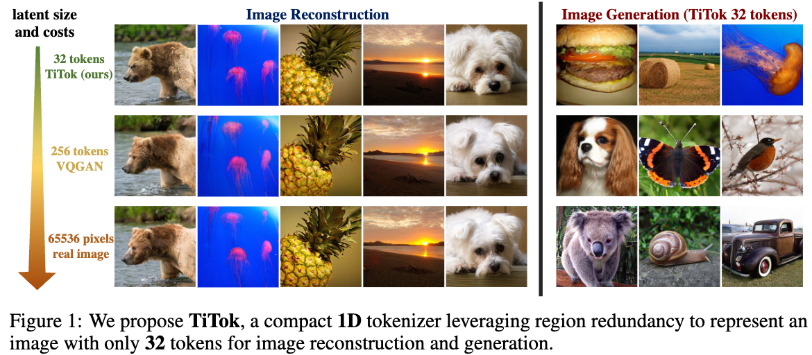
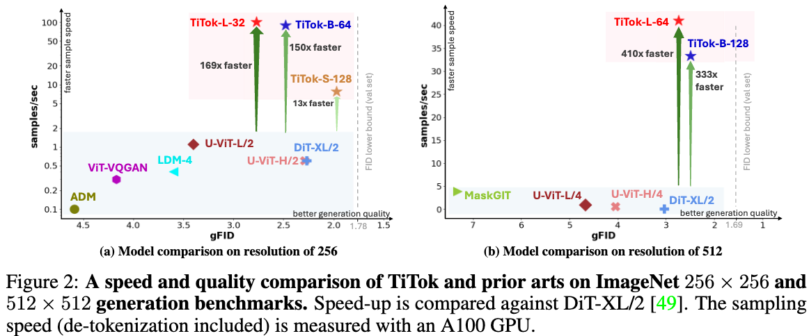
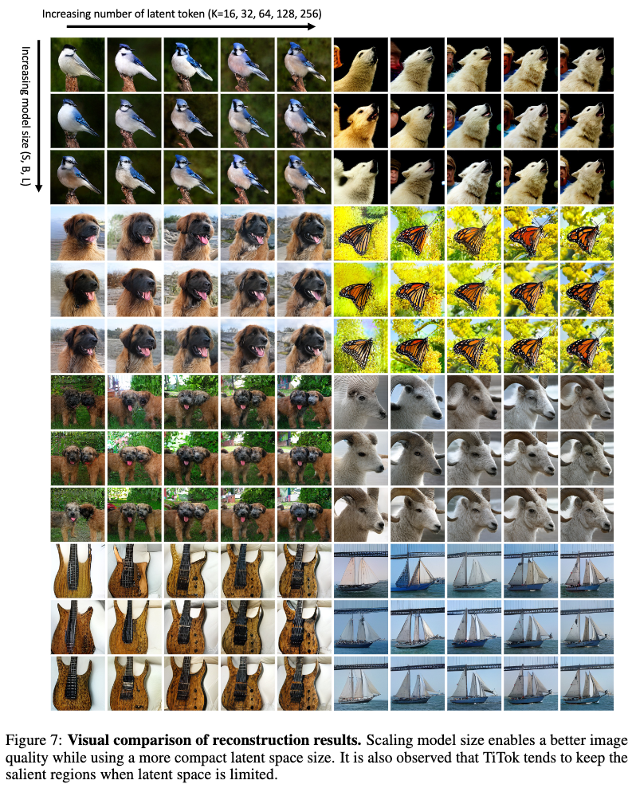
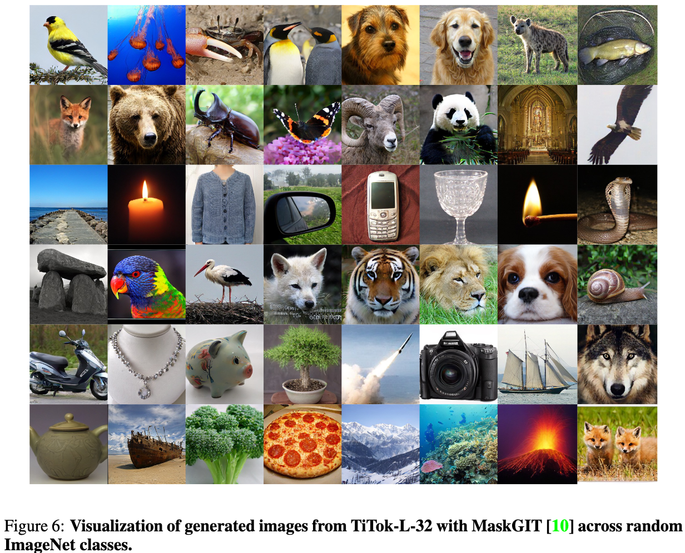

# Compact and Mighty - Image Tokenization with Only 32 Tokens for both Reconstruction and Generation!

<div align="center">

[](https://huggingface.co/spaces/fun-research/TiTok)&nbsp;&nbsp;
[](https://yucornetto.github.io/projects/titok.html)&nbsp;&nbsp;
[](https://arxiv.org/abs/2406.07550)&nbsp;&nbsp;

</div>

We present a compact 1D tokenizer which can represent an image with as few as 32 discrete tokens. As a result, it leads to a substantial speed-up on the sampling process (e.g., **410 × faster** than DiT-XL/2) while obtaining a competitive generation quality.


<p>

</p>
<p>

</p>

## 🚀 Contributions

#### We introduce a novel 1D image tokenization framework that breaks grid constraints existing in 2D tokenization methods, leading to a much more flexible and compact image latent representation.

#### The proposed 1D tokenizer can tokenize a 256 × 256 image into as few as 32 discrete tokens, leading to a signigicant speed-up (hundreds times faster than diffusion models) in generation process, while maintaining state-of-the-art generation quality.

#### We conduct a series of experiments to probe the properties of rarely studied 1D image tokenization, paving the path towards compact latent space for efficient and effective image representation.

## Model Zoo
| Dataset  | Model | Link | FID |
| ------------- | ------------- | ------------- | ------------- |
| ImageNet  | TiTok-L-32 Tokenizer | [checkpoint](https://drive.google.com/file/d/1I_m2Vm4JgQsa7bZVORj-nVhP8fgQLngd/view?usp=sharing), [hf model](https://huggingface.co/fun-research/TiTok/blob/main/tokenizer_titok_l32.bin)| 2.21 (reconstruction) |
| ImageNet  | TiTok-B-64 Tokenizer | TODO | 1.70 (reconstruction) |
| ImageNet  | TiTok-S-128 Tokenizer | TODO | 1.71 (reconstruction) |
| ImageNet  | TiTok-L-32 Generator | [checkpoint](https://drive.google.com/file/d/1IgqZ_vwGIj2ZWOPuCzilxeQ2UrMVY93l/view?usp=sharing), [hf model](https://huggingface.co/fun-research/TiTok/blob/main/generator_titok_l32.bin) | 2.77 (generation) |
| ImageNet  | TiTok-B-64 Generator | TODO | 2.48 (generation) |
| ImageNet  | TiTok-S-128 Generator | TODO | 1.97 (generation) |

Please note that these models are trained only on limited academic dataset ImageNet, and they are only for research purposes.

## Installation
```shell
pip3 install -r requirements.txt
```

## Get Started

We provide a [jupyter notebook](demo.ipynb) for a quick tutorial on reconstructing and generating images with TiTok-L-32.

We also support TiTok with [HuggingFace 🤗 Demo](https://huggingface.co/spaces/fun-research/TiTok)!

## Visualizations
<p>

</p>
<p>

</p>


## Citing
If you use our work in your research, please use the following BibTeX entry.

```BibTeX
@article{yu2024an,
  author    = {Qihang Yu and Mark Weber and Xueqing Deng and Xiaohui Shen and Daniel Cremers and Liang-Chieh Chen},
  title     = {An Image is Worth 32 Tokens for Reconstruction and Generation},
  journal   = {arxiv: 2406.07550},
  year      = {2024}
}
```

## Acknowledgement

[MaskGIT](https://github.com/google-research/maskgit)

[Taming-Transformers](https://github.com/CompVis/taming-transformers)

[Open-MUSE](https://github.com/huggingface/open-muse)

[MUSE-Pytorch](https://github.com/baaivision/MUSE-Pytorch)
