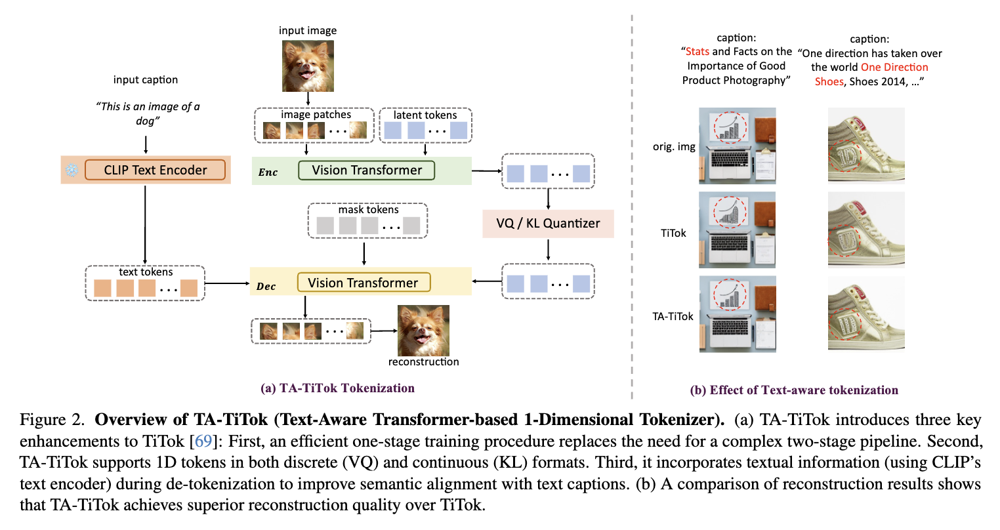
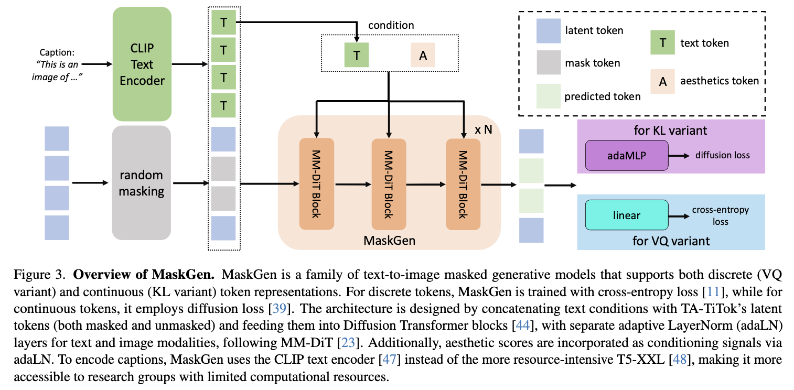

# 1D Visual Tokenization and Generation

This repo hosts the code and models for the following projects:

- FlowTok: [FlowTok: Flowing Seamlessly Across Text and Image Tokens](https://tacju.github.io/projects/flowtok.html)

- TA-TiTok & MaskGen: [Democratizing Text-to-Image Masked Generative Models with Compact Text-Aware One-Dimensional Tokens](https://tacju.github.io/projects/maskgen.html)

- RAR: [Randomized Autoregressive Visual Generation](https://yucornetto.github.io/projects/rar.html)

- TiTok: [An Image is Worth 32 Tokens for Reconstruction and Generation](https://yucornetto.github.io/projects/titok.html)

## Updates
- 03/16/2025: The [tech report](https://arxiv.org/abs/2503.10772) of FlowTok is available. FlowTok is a minimal yet powerful framework that seamlessly flows across text and images by encoding images into a compact 1D token representation. Code will be released soon.
- 02/24/2025: We release the training code, inference code and model weights of MaskGen.
- 01/17/2025: We release the training code, inference code and model weights of TA-TiTok.
- 01/14/2025: The [tech report](https://arxiv.org/abs/2501.07730) of TA-TiTok and MaskGen is available. TA-TiTok is an innovative text-aware transformer-based 1-dimensional tokenizer designed to handle both discrete and continuous tokens. MaskGen is a powerful and efficient text-to-image masked generative model trained exclusively on open-data. For more details, refer to the [README_MaskGen](README_MaskGen.md).
- 11/04/2024: We release the [tech report](https://arxiv.org/abs/2411.00776) and code for RAR models.
- 10/16/2024: We update a set of TiTok tokenizer weights trained with an updated single-stage recipe, leading to easier training and better performance. We release the weight of different model size for both VQ and VAE variants TiTok, which we hope could facilitate the research in this area. More details are available in the [tech report](https://arxiv.org/abs/2501.07730) of TA-TiTok. 
- 09/25/2024: TiTok is accepted by NeurIPS 2024.
- 09/11/2024: Release the training codes of generator based on TiTok. 
- 08/28/2024: Release the training codes of TiTok.
- 08/09/2024: Better support on loading pretrained weights from huggingface models, thanks for the help from [@NielsRogge](https://github.com/NielsRogge)！
- 07/03/2024: Evaluation scripts for reproducing the results reported in the paper, checkpoints of TiTok-B64 and TiTok-S128 are available.
- 06/21/2024: Demo code and TiTok-L-32 checkpoints release. 
- 06/11/2024: The [tech report](https://arxiv.org/abs/2406.07550) of TiTok is available.

## Short Intro on [Democratizing Text-to-Image Masked Generative Models with Compact Text-Aware One-Dimensional Tokens](https://arxiv.org/abs/2501.07730) ([README](README_MaskGen.md))

We introduce TA-TiTok, a novel text-aware transformer-based 1D tokenizer designed to handle both discrete and continuous tokens while effectively aligning reconstructions with textual descriptions.
Building on TA-TiTok, we present MaskGen, a versatile text-to-image masked generative model framework. Trained exclusively on open data, MaskGen demonstrates outstanding performance: with 32 continuous tokens, it achieves a FID score of 6.53 on MJHQ-30K, and with 128 discrete tokens, it attains an overall score of 0.57 on GenEval.

<p>

</p>
<p>

</p>

See more details at [README_MaskGen](README_MaskGen.md).

## Short Intro on [Randomized Autoregressive Visual Generation](https://arxiv.org/abs/2411.00776) ([README](README_RAR.md))

RAR is a an autoregressive (AR) image generator with full compatibility to language modeling. It introduces a randomness annealing strategy with permuted objective at no additional cost, which enhances the model's ability to learn bidirectional contexts while leaving the autoregressive framework intact. RAR sets a FID score 1.48, demonstrating state-of-the-art performance on ImageNet-256 benchmark and significantly outperforming prior AR image generators.

<p>

</p>
<p>

</p>

See more details at [README_RAR](README_RAR.md).

## Short Intro on [An Image is Worth 32 Tokens for Reconstruction and Generation](https://arxiv.org/abs/2406.07550) ([README](README_TiTok.md))

We present a compact 1D tokenizer which can represent an image with as few as 32 discrete tokens. As a result, it leads to a substantial speed-up on the sampling process (e.g., **410 × faster** than DiT-XL/2) while obtaining a competitive generation quality.

<p>

</p>
<p>

</p>

See more details at [README_TiTok](README_TiTok.md).


## Installation
```shell
pip3 install -r requirements.txt
```

## Citing
If you use our work in your research, please use the following BibTeX entry.

```BibTeX
@article{he2025flowtok,
  author    = {Ju He and Qihang Yu and Qihao Liu and Liang-Chieh Chen},
  title     = {FlowTok: Flowing Seamlessly Across Text and Image Tokens},
  journal   = {arXiv preprint arXiv:2503.10772},
  year      = {2025}
}
```

```BibTeX
@article{kim2025democratizing,
  author    = {Dongwon Kim and Ju He and Qihang Yu and Chenglin Yang and Xiaohui Shen and Suha Kwak and Liang-Chieh Chen},
  title     = {Democratizing Text-to-Image Masked Generative Models with Compact Text-Aware One-Dimensional Tokens},
  journal   = {arXiv preprint arXiv:2501.07730},
  year      = {2025}
}
```

```BibTeX
@article{yu2024randomized,
  author    = {Qihang Yu and Ju He and Xueqing Deng and Xiaohui Shen and Liang-Chieh Chen},
  title     = {Randomized Autoregressive Visual Generation},
  journal   = {arXiv preprint arXiv:2411.00776},
  year      = {2024}
}
```

```BibTeX
@article{yu2024an,
  author    = {Qihang Yu and Mark Weber and Xueqing Deng and Xiaohui Shen and Daniel Cremers and Liang-Chieh Chen},
  title     = {An Image is Worth 32 Tokens for Reconstruction and Generation},
  journal   = {NeurIPS},
  year      = {2024}
}
```

## Acknowledgement

[CrossFlow](https://github.com/qihao067/CrossFlow)

[MAR](https://github.com/LTH14/mar)

[MaskGIT](https://github.com/google-research/maskgit)

[Taming-Transformers](https://github.com/CompVis/taming-transformers)

[Open-MUSE](https://github.com/huggingface/open-muse)

[MUSE-Pytorch](https://github.com/baaivision/MUSE-Pytorch)
