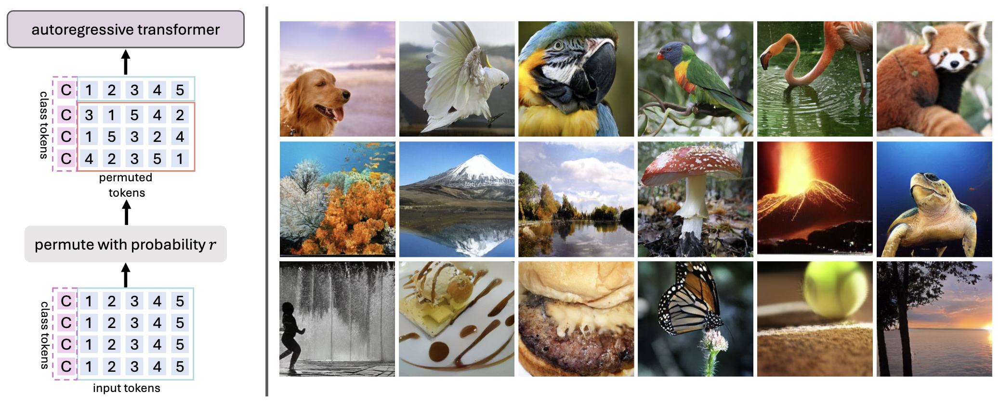
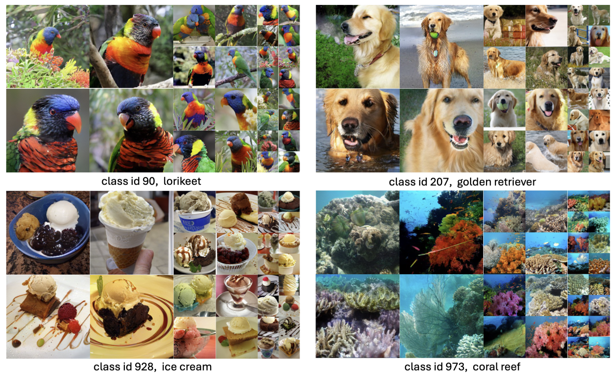
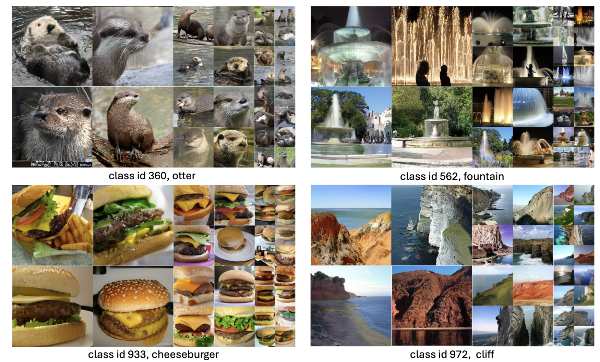
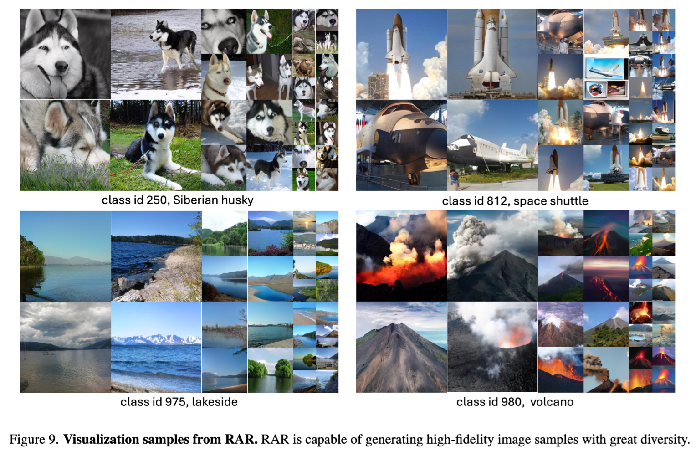

# Randomized Autoregressive Visual Generation


<div align="center">

[](https://huggingface.co/spaces/yucornetto/RAR)&nbsp;&nbsp;
[](https://yucornetto.github.io/projects/rar.html)&nbsp;&nbsp;
[](https://arxiv.org/abs/2411.00776)&nbsp;&nbsp;
[](https://paperswithcode.com/sota/image-generation-on-imagenet-256x256?p=randomized-autoregressive-visual-generation)

</div>

RAR is a an autoregressive (AR) image generator with full compatibility to language modeling. It introduces a randomness annealing strategy with permuted objective at no additional cost, which enhances the model's ability to learn bidirectional contexts while leaving the autoregressive framework intact. RAR sets a FID score 1.48, demonstrating state-of-the-art performance on ImageNet-256 benchmark and significantly outperforming prior AR image generators.


<p>

</p>
<p>

</p>


## 🚀 Contributions

#### We introduce RAR, an improved training strategy enabling standard autoregressive image generator to achieve state-of-the-art performance.

#### The proposed RAR is extremly simple yet effective: During training, we randomly permute the input token sequence with probability r, where r will starts at 1.0 and linearly decays to 0.0 over the course of training. This simple strategy enbales better bidirectional representation learning which is missing in standard raster-order-based AR image generator training.

#### RAR keeps the AR framework intact, and thus it is totally compatible to the LLM optimization techniques, such as KV-cache, leading to a significantly faster sampling speed compared to MAR-H or MaskBit while maintaining a better performance.

## Model Zoo
| Model | Link | FID |
| ------------- | ------------- | ------------- |
| RAR-B | [checkpoint](https://huggingface.co/yucornetto/RAR/blob/main/rar_b.bin)| 1.95 (generation) |
| RAR-L | [checkpoint](https://huggingface.co/yucornetto/RAR/blob/main/rar_l.bin)| 1.70 (generation) |
| RAR-XL | [checkpoint](https://huggingface.co/yucornetto/RAR/blob/main/rar_xl.bin)| 1.50 (generation) |
| RAR-XXL | [checkpoint](https://huggingface.co/yucornetto/RAR/blob/main/rar_xxl.bin)| 1.48 (generation) |

Please note that these models are trained only on limited academic dataset ImageNet, and they are only for research purposes.

## Installation
```shell
pip3 install -r requirements.txt
```

## Get Started
```python
import torch
from PIL import Image
import numpy as np
import demo_util
from huggingface_hub import hf_hub_download
from utils.train_utils import create_pretrained_tokenizer


# Choose one from ["rar_b_imagenet", "rar_l_imagenet", "rar_xl_imagenet", "rar_xxl_imagenet"]
rar_model_size = ["rar_b", "rar_l", "rar_xl", "rar_xxl"][3]

# download the maskgit-vq tokenizer
hf_hub_download(repo_id="fun-research/TiTok", filename=f"maskgit-vqgan-imagenet-f16-256.bin", local_dir="./")
# download the rar generator weight
hf_hub_download(repo_id="yucornetto/RAR", filename=f"{rar_model_size}.bin", local_dir="./")

# load config
config = demo_util.get_config("configs/training/generator/rar.yaml")
config.experiment.generator_checkpoint = f"{rar_model_size}.bin"
config.model.generator.hidden_size = {"rar_b": 768, "rar_l": 1024, "rar_xl": 1280, "rar_xxl": 1408}[rar_model_size]
config.model.generator.num_hidden_layers = {"rar_b": 24, "rar_l": 24, "rar_xl": 32, "rar_xxl": 40}[rar_model_size]
config.model.generator.num_attention_heads = 16
config.model.generator.intermediate_size = {"rar_b": 3072, "rar_l": 4096, "rar_xl": 5120, "rar_xxl": 6144}[rar_model_size]


device = "cuda"
# maskgit-vq as tokenizer
tokenizer = create_pretrained_tokenizer(config)
generator = demo_util.get_rar_generator(config)
tokenizer.to(device)
generator.to(device)

# generate an image
sample_labels = [torch.randint(0, 999, size=(1,)).item()] # random IN-1k class
generated_image = demo_util.sample_fn(
    generator=generator,
    tokenizer=tokenizer,
    labels=sample_labels,
    randomize_temperature=1.0,
    guidance_scale=4.0,
    guidance_scale_pow=0.0, # constant cfg
    device=device
)
Image.fromarray(generated_image[0]).save(f"assets/rar_generated_{sample_labels[0]}.png")
```

## Testing on ImageNet-1K Benchmark

We provide a [sampling script](./sample_imagenet_rar.py) for reproducing the generation results on ImageNet-1K benchmark.
```bash
# Prepare ADM evaluation script
git clone https://github.com/openai/guided-diffusion.git

wget https://openaipublic.blob.core.windows.net/diffusion/jul-2021/ref_batches/imagenet/256/VIRTUAL_imagenet256_labeled.npz
```
```python
# Reproducing RAR-B
torchrun --nnodes=1 --nproc_per_node=8 --rdzv-endpoint=localhost:9999 sample_imagenet_rar.py config=configs/training/generator/rar.yaml \
    experiment.output_dir="rar_b" \
    experiment.generator_checkpoint="rar_b.bin" \
    model.generator.hidden_size=768 \
    model.generator.num_hidden_layers=24 \
    model.generator.num_attention_heads=16 \
    model.generator.intermediate_size=3072 \
    model.generator.randomize_temperature=1.0 \
    model.generator.guidance_scale=16.0 \
    model.generator.guidance_scale_pow=2.75
# Run eval script. The result FID should be ~1.95
python3 guided-diffusion/evaluations/evaluator.py VIRTUAL_imagenet256_labeled.npz rar_b.npz

# Reproducing RAR-L
torchrun --nnodes=1 --nproc_per_node=8 --rdzv-endpoint=localhost:9999 sample_imagenet_rar.py config=configs/training/generator/rar.yaml \
    experiment.output_dir="rar_l" \
    experiment.generator_checkpoint="rar_l.bin" \
    model.generator.hidden_size=1024 \
    model.generator.num_hidden_layers=24 \
    model.generator.num_attention_heads=16 \
    model.generator.intermediate_size=4096 \
    model.generator.randomize_temperature=1.02 \
    model.generator.guidance_scale=15.5 \
    model.generator.guidance_scale_pow=2.5
# Run eval script. The result FID should be ~1.70
python3 guided-diffusion/evaluations/evaluator.py VIRTUAL_imagenet256_labeled.npz rar_l.npz

# Reproducing RAR-XL
torchrun --nnodes=1 --nproc_per_node=8 --rdzv-endpoint=localhost:9999 sample_imagenet_rar.py config=configs/training/generator/rar.yaml \
    experiment.output_dir="rar_xl" \
    experiment.generator_checkpoint="rar_xl.bin" \
    model.generator.hidden_size=1280 \
    model.generator.num_hidden_layers=32 \
    model.generator.num_attention_heads=16 \
    model.generator.intermediate_size=5120 \
    model.generator.randomize_temperature=1.02 \
    model.generator.guidance_scale=6.9 \
    model.generator.guidance_scale_pow=1.5
# Run eval script. The result FID should be ~1.50
python3 guided-diffusion/evaluations/evaluator.py VIRTUAL_imagenet256_labeled.npz rar_xl.npz

# Reproducing RAR-XXL
torchrun --nnodes=1 --nproc_per_node=8 --rdzv-endpoint=localhost:9999 sample_imagenet_rar.py config=configs/training/generator/rar.yaml \
    experiment.output_dir="rar_xxl" \
    experiment.generator_checkpoint="rar_xxl.bin" \
    model.generator.hidden_size=1408 \
    model.generator.num_hidden_layers=40 \
    model.generator.num_attention_heads=16 \
    model.generator.intermediate_size=6144 \
    model.generator.randomize_temperature=1.02 \
    model.generator.guidance_scale=8.0 \
    model.generator.guidance_scale_pow=1.2
# Run eval script. The result FID should be ~1.48
python3 guided-diffusion/evaluations/evaluator.py VIRTUAL_imagenet256_labeled.npz rar_xxl.npz
```
## Training Preparation
We pretokenize the whole dataset for speed-up the training process. We have uploaded [it](https://huggingface.co/yucornetto/RAR/blob/main/maskgitvq.jsonl) so you can train RAR directly. The training script will download the prerequisite checkpoints and dataset automatically.

For pretokenization on your own tokenizer or dataset, please refer to the [example pretokenization script](scripts/pretokenization.py).

## Training
We provide example commands to train RAR as follows:
```bash
# Training for RAR-B
WANDB_MODE=offline accelerate launch --num_machines=4 --num_processes=32 --machine_rank=${MACHINE_RANK} --main_process_ip=${ROOT_IP} --main_process_port=${ROOT_PORT} --same_network scripts/train_rar.py config=configs/training/generator/rar.yaml \
    experiment.project="rar" \
    experiment.name="rar_b" \
    experiment.output_dir="rar_b" \
    model.generator.hidden_size=768 \
    model.generator.num_hidden_layers=24 \
    model.generator.num_attention_heads=16 \
    model.generator.intermediate_size=3072

# Training for RAR-L
WANDB_MODE=offline accelerate launch --num_machines=4 --num_processes=32 --machine_rank=${MACHINE_RANK} --main_process_ip=${ROOT_IP} --main_process_port=${ROOT_PORT} --same_network scripts/train_rar.py config=configs/training/generator/rar.yaml \
    experiment.project="rar" \
    experiment.name="rar_l" \
    experiment.output_dir="rar_l" \
    model.generator.hidden_size=1024 \
    model.generator.num_hidden_layers=24 \
    model.generator.num_attention_heads=16 \
    model.generator.intermediate_size=4096

# Training for RAR-XL
WANDB_MODE=offline accelerate launch --num_machines=4 --num_processes=32 --machine_rank=${MACHINE_RANK} --main_process_ip=${ROOT_IP} --main_process_port=${ROOT_PORT} --same_network scripts/train_rar.py config=configs/training/generator/rar.yaml \
    experiment.project="rar" \
    experiment.name="rar_xl" \
    experiment.output_dir="rar_xl" \
    model.generator.hidden_size=1280 \
    model.generator.num_hidden_layers=32 \
    model.generator.num_attention_heads=16 \
    model.generator.intermediate_size=5120

# Training for RAR-XXL
WANDB_MODE=offline accelerate launch --num_machines=4 --num_processes=32 --machine_rank=${MACHINE_RANK} --main_process_ip=${ROOT_IP} --main_process_port=${ROOT_PORT} --same_network scripts/train_rar.py config=configs/training/generator/rar.yaml \
    experiment.project="rar" \
    experiment.name="rar_xxl" \
    experiment.output_dir="rar_xxl" \
    model.generator.hidden_size=1408 \
    model.generator.num_hidden_layers=40 \
    model.generator.num_attention_heads=16 \
    model.generator.intermediate_size=6144
```
You may remove the flag "WANDB_MODE=offline" to support online wandb logging, if you have configured it.

Notably, you can enable grad checkpointing by adding the flag "model.generator.use_checkpoint=True" and adjust the machine number & GPU number based on your own need. All RAR checkpoints were trained with a global batchsize = 2048.


## Visualizations
<p>

</p>
<p>

</p>
<p>

</p>


## Citing
If you use our work in your research, please use the following BibTeX entry.

```BibTeX
@inproceedings{yu2024randomized,
  author    = {Qihang Yu and Ju He and Xueqing Deng and Xiaohui Shen and Liang-Chieh Chen},
  title     = {Randomized Autoregressive Visual Generation},
  journal   = {arXiv preprint arXiv:2411.00776},
  year      = {2024}
}
```